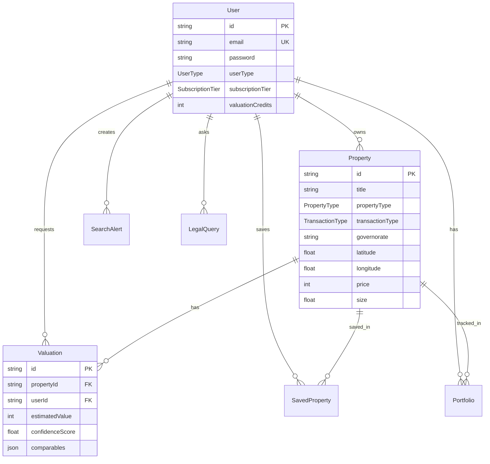

# Architecture

## Vue d'Ensemble du Système

EstateMind est une application full-stack construite avec une architecture moderne et scalable.

```
┌─────────────────────────────────────────────────────────────┐
│                         Frontend                              │
│                      Next.js 14 App                           │
│                   (Vercel Deployment)                         │
│                                                               │
│  ┌─────────────┐  ┌──────────────┐  ┌────────────────┐     │
│  │   Pages     │  │  Components  │  │   API Routes   │     │
│  │  (Auth,     │  │  (UI, Map,   │  │  (REST APIs)   │     │
│  │ Dashboard)  │  │  Property)   │  │                │     │
│  └─────────────┘  └──────────────┘  └────────────────┘     │
└─────────────────────────────────────────────────────────────┘
                              ↓
┌─────────────────────────────────────────────────────────────┐
│                    Database Layer                             │
│                   PostgreSQL + Prisma                         │
│                                                               │
│  ┌─────────┐ ┌──────────┐ ┌──────────┐ ┌────────────┐      │
│  │  Users  │ │Properties│ │Valuations│ │ Portfolio  │      │
│  └─────────┘ └──────────┘ └──────────┘ └────────────┘      │
└─────────────────────────────────────────────────────────────┘
                              ↓
┌─────────────────────────────────────────────────────────────┐
│                     AI Service                                │
│                 Python FastAPI Service                        │
│              (Railway/Render Deployment)                      │
│                                                               │
│  ┌──────────────────┐  ┌─────────────────────┐             │
│  │ Valuation Model  │  │  Comparable Finder  │             │
│  └──────────────────┘  └─────────────────────┘             │
└─────────────────────────────────────────────────────────────┘
```

## Stack Technique Détaillé

### Frontend (Next.js 14)

- **Framework**: Next.js 14 avec App Router
- **Language**: TypeScript
- **Styling**: Tailwind CSS
- **UI Components**: shadcn/ui (Radix UI)
- **Maps**: Mapbox GL JS
- **State Management**: 
  - React Context pour l'état global
  - Zustand pour la gestion d'état complexe
- **Forms**: React Hook Form + Zod validation
- **HTTP Client**: Fetch API native

### Backend (Next.js API Routes)

- **API Routes**: Next.js App Router API routes
- **Authentication**: NextAuth.js v4
  - JWT tokens
  - Credentials provider
  - Session management
- **Validation**: Zod schemas
- **Security**:
  - bcryptjs pour le hashing de mots de passe
  - CORS configuration
  - Rate limiting (à implémenter)

### Database

- **Type**: PostgreSQL
- **ORM**: Prisma
- **Hébergement**: Neon, Vercel Postgres, ou Supabase
- **Migrations**: Prisma Migrate
- **Seeding**: Scripts TypeScript

### AI/ML Service

- **Framework**: FastAPI (Python)
- **Modèles**: Scikit-learn (Phase 1)
- **Deployment**: Railway, Render, ou Fly.io
- **API**: RESTful endpoints
- **Future**: TensorFlow/PyTorch pour modèles avancés

## Schéma de Base de Données

### Entités Principales



## Flux de Données

### 1. Authentification

```
User → Login Form → /api/auth/login → NextAuth → JWT Token → Session
```

### 2. Recherche de Propriété

```
User → Search Form → /api/properties?filters → Database Query → Properties List
```

### 3. Évaluation AI

```
User → Property Page → Request Valuation → 
  ↓
Check Credits → Deduct Credit → 
  ↓
Call AI Service → Calculate Value → 
  ↓
Save to DB → Return Result → Display Report
```

### 4. Gestion de Portefeuille (Investisseurs)

```
Investor → Portfolio Dashboard → /api/portfolio → 
  ↓
Fetch Properties → Calculate Performance → 
  ↓
Display Metrics → Charts → Recommendations
```

## Sécurité

### Authentication & Authorization

1. **NextAuth.js**: Session management avec JWT
2. **Password Hashing**: bcryptjs avec salt rounds
3. **Protected Routes**: Middleware pour vérifier l'authentification
4. **Role-Based Access**: Vérification du userType pour les features premium

### API Security

1. **CORS**: Configuration stricte des origines autorisées
2. **Rate Limiting**: À implémenter avec upstash/redis
3. **Input Validation**: Zod schemas pour toutes les entrées
4. **SQL Injection Protection**: Prisma ORM parameterized queries

### Data Privacy

1. **Password**: Jamais exposé dans les réponses API
2. **Personal Data**: Accès restreint aux données utilisateur
3. **GDPR Compliance**: Export et suppression de données

## Performance

### Optimisations Frontend

1. **Server Components**: Maximum de rendering côté serveur
2. **Image Optimization**: next/image pour toutes les images
3. **Code Splitting**: Dynamic imports pour les composants lourds
4. **Caching**: Stratégies de cache pour les données statiques

### Optimisations Database

1. **Indexes**: Sur les colonnes fréquemment requêtées
2. **Pagination**: Limit/offset pour les grandes listes
3. **Connection Pooling**: Prisma connection pool
4. **Query Optimization**: Select only needed fields

### Optimisations API

1. **Response Compression**: Gzip/Brotli
2. **CDN**: Vercel Edge Network
3. **Caching**: Redis pour les données fréquentes (future)

## Deployment

### Frontend (Vercel)

```bash
# Automatic deployment on git push
git push origin main

# Environment variables configured in Vercel dashboard
```

### Database

```bash
# Run migrations
npx prisma migrate deploy

# Seed data (production)
npx prisma db seed
```

### AI Service

```bash
# Build Docker image
docker build -t estatemind-ai ./ai-service

# Deploy to Railway/Render
railway up
# or
render deploy
```

## Monitoring & Logging

### Frontend

- **Vercel Analytics**: Page views, performance metrics
- **Error Tracking**: Sentry (à implémenter)
- **Performance**: Web Vitals tracking

### Backend

- **Database**: Prisma query logging
- **API**: Request/response logging
- **Errors**: Structured error logging

### AI Service

- **FastAPI**: Uvicorn access logs
- **Model Performance**: Accuracy tracking
- **Errors**: Python logging module

## Scalabilité

### Horizontal Scaling

1. **Frontend**: Automatic avec Vercel
2. **Database**: Connection pooling, read replicas
3. **AI Service**: Multiple instances avec load balancer

### Vertical Scaling

1. **Database**: Upgrade plan (Neon/Vercel Postgres)
2. **AI Service**: Increase CPU/RAM allocation

## Future Enhancements

1. **Redis Cache**: Pour les données fréquentes
2. **GraphQL**: Alternative à REST API
3. **Websockets**: Real-time updates
4. **Message Queue**: RabbitMQ/Redis pour background jobs
5. **Microservices**: Séparer les services par domaine
6. **Kubernetes**: Pour orchestration complexe
